# A QWERTY keymap for the Redox keyboard

----

----

This keymap is **a work in progress**, and is meant to be used on LINUX, Windows, MAC, with the "Unicode Hex Input"
keyboard input.

I may change a lot of the keys over the next few months, and will update this repo when I do so.

[View on KLE](http://www.keyboard-layout-editor.com/#/gists/5954dfc8310cdfc4e32cbe175ff0075e)

The Keyboard firmware can be found here: <https://github.com/attydeak/qmk_firmware/tree/master/keyboards/redox/keymaps/ad>

## Layers

My keymap uses 5 layers:

1. The default base layer, using QWERTY.
2. A Navigation / Media layer, with both sound control and arrows on the home row. (bottom right legends)
3. A Symbol layer, so all symbols can be accessed from the home row. (top right legends)
4. An international / Emoji layer so I can type a few Emoji I often use. (top center legends)
5. A keyboard control layer, not pictured above, allowing me to control the Boot and the keyboard debug functions.

## Changelog

- 2023-01-24
  - Initial configuration with the mandatory tinkering
- 2023-02-06
  - Layout adjustments

## Credits

- Redox keyboard design by [Mattia Dal Ben](https://github.com/mattdibi/redox-keyboard).

- Layout ideas by jaherve [jaherve](https://github.com/jeherve/redox-layout)

- This keymap is based off the default keymap for the Redox keyboard, available
[here](https://github.com/qmk/qmk_firmware/tree/master/keyboards/redox) and also build by Mattia Dal Ben (thank you!).
- This layout uses [QMK keyboard controller firmware](https://github.com/qmk/qmk_firmware/).

I've also read posts by [Gergely Nagy](https://asylum.madhouse-project.org/blog/2016/10/15/multi-purpose-keys/),
[Rebecca Le](https://sevenseacat.net/posts/2018/unicode-in-qmk-on-osx/), and
[Justin Rogers](https://implementsblog.com/2016/10/16/my-ergodox-ezs-custom-layout/#comments) for inspiration.

## WIP: Documenting the construction process

### Tracking the Keyboard Project

This is just to share my custom keyboard journey. The used wood: recovered pallet wood.
All the wood processing was done manually.
Used switches: Kailh Speed Copper tactile switches

### Pictures to track the building process

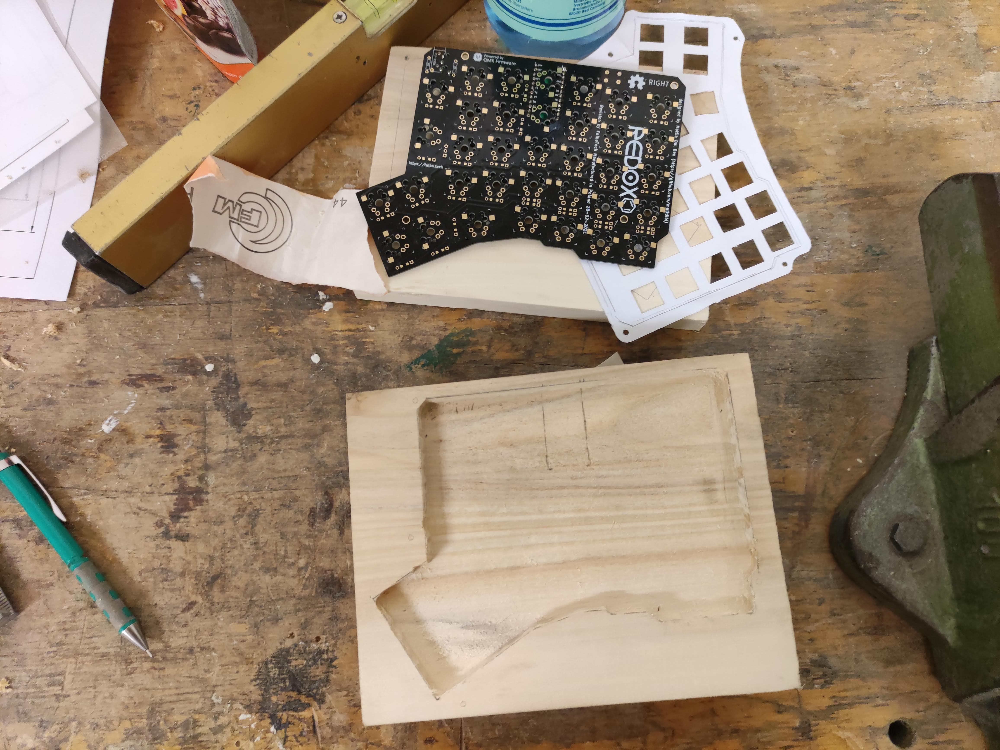 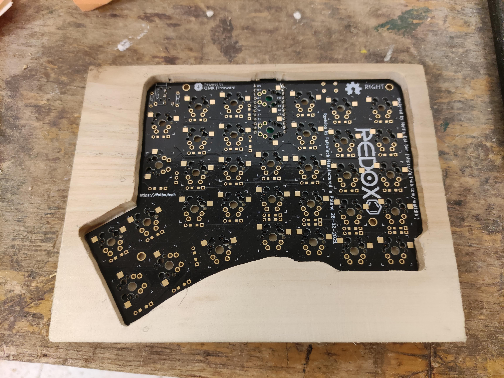

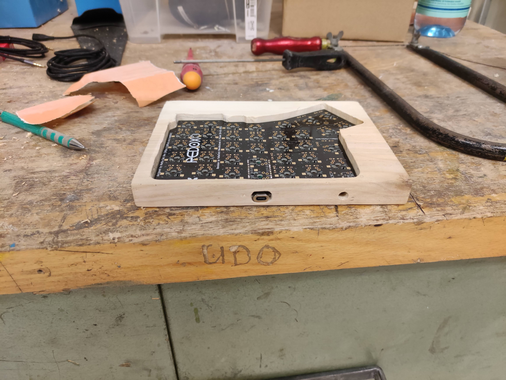 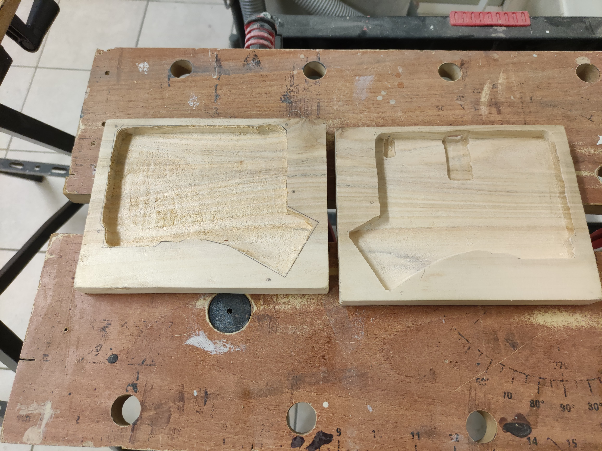

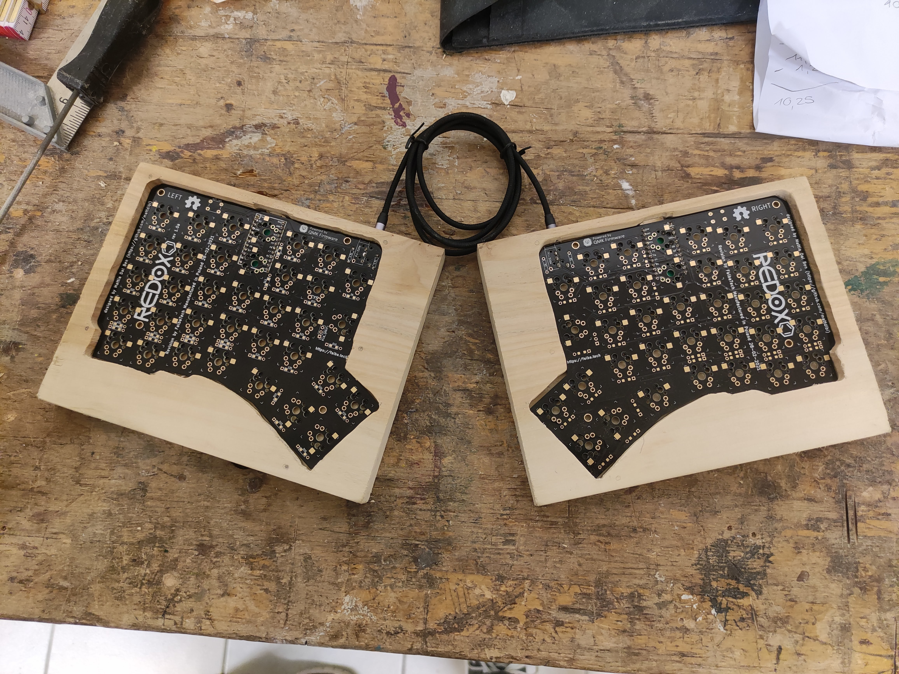 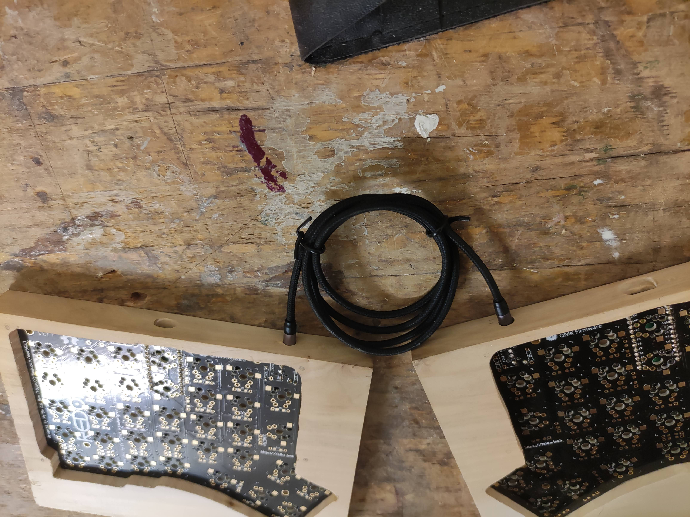

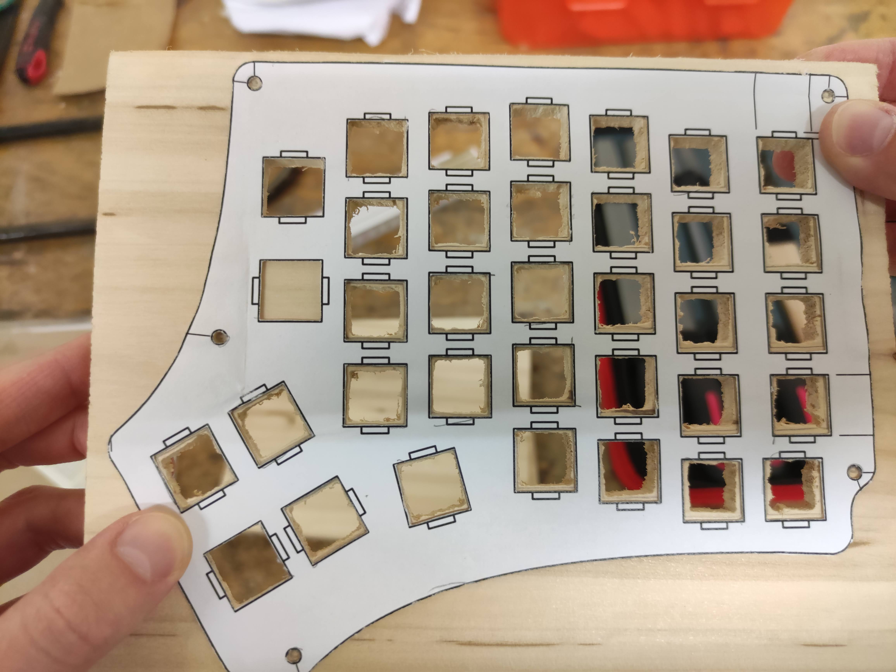 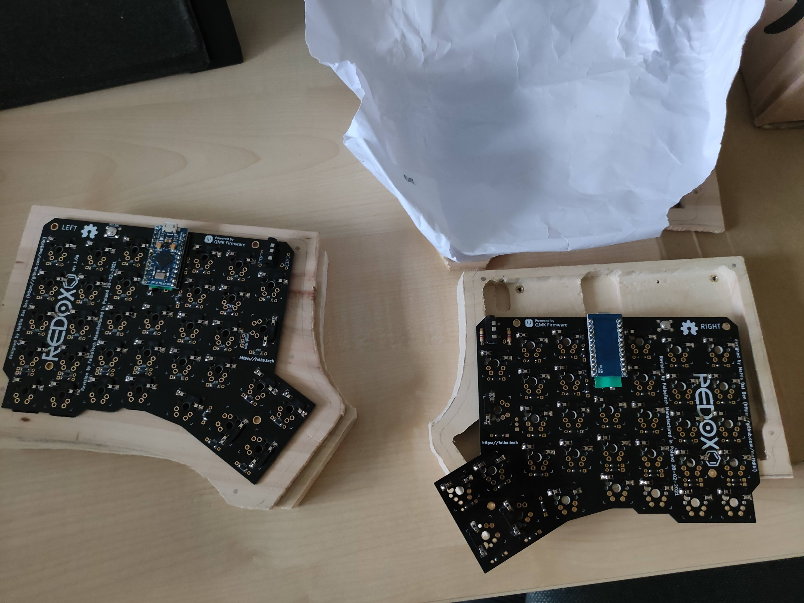

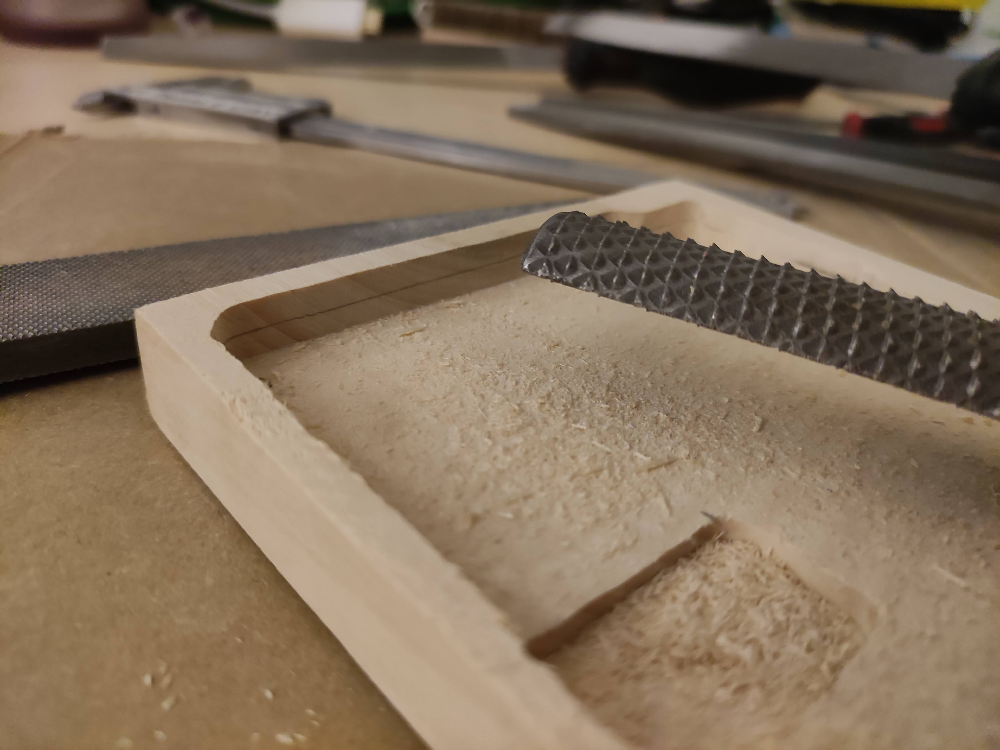 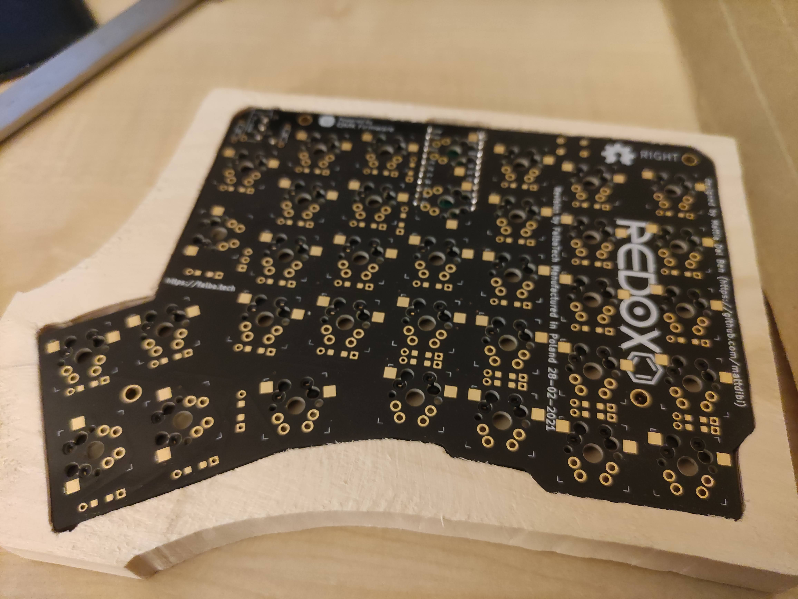

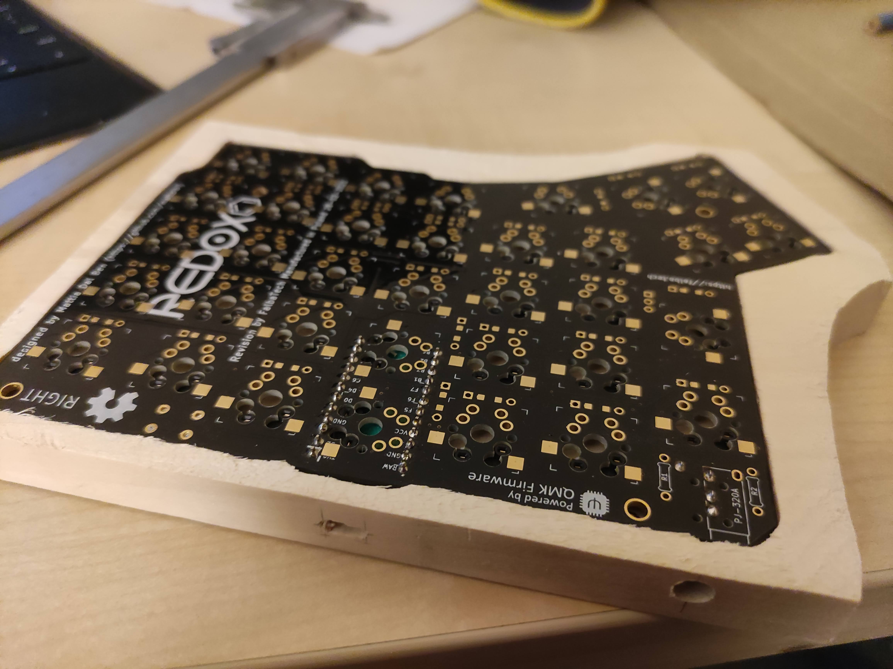 

 

 

 

 

 

 

 

 

 

 

 

 

 

 

 

 

 

 

 

 

 

 

 

 
